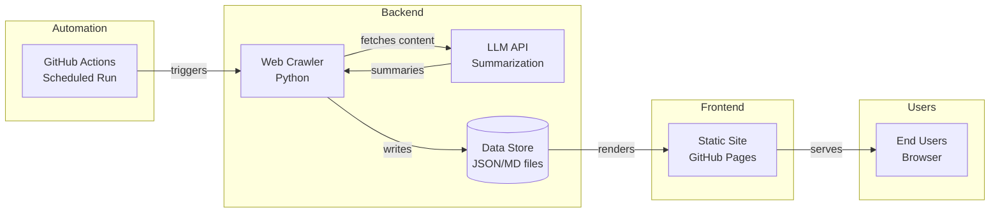

# Solution Design

## Project: Agentic AI Landscape Tracker

---

## Architecture Overview



---

## Components

### 1. Web Crawler (Standalone Application)

**Purpose:** Fetch and parse content from target sources

**Responsibilities:**
- Crawl configured source URLs (blogs, changelogs, announcement pages)
- Extract relevant content (title, date, link, source, full text)
- Generate brief summaries using LLM (2-3 sentences)
- Output structured data (JSON) for the static site
- Detect and flag new/updated content
- Support backfill mode for historical content (from January 2024)

**Target Sources (Initial):**
- Anthropic Blog / Announcements
- Cursor Changelog / Blog
- GitHub Copilot Blog / Announcements
- OpenAI Blog
- Google DeepMind / Gemini updates
- Other major players (expandable)

**Tech Stack:**
- **Python**: `requests`, `beautifulsoup4`, `feedparser` for RSS

**LLM Integration:**
- GitHub Copilot SDK (`pip install github-copilot-sdk`)
- Reference: [github/copilot-sdk](https://github.com/github/copilot-sdk)
- Prompt: Generate 2-3 sentence summary of announcement, highlighting key capabilities/changes
- Requires GitHub Copilot subscription

### 2. Data Store

**Purpose:** Persist crawled content in Git-friendly format

**Format:**
- JSON files for structured data (`/data/entries.json`)
- Optionally Markdown files per entry for richer content

**Schema (per entry):**
```json
{
  "id": "unique-id",
  "title": "Announcement Title",
  "source": "Anthropic",
  "url": "https://...",
  "date": "2025-01-31",
  "summary": "Brief 2-3 sentence summary",
  "category": "Release|Feature|Research|Other",
  "tags": ["Claude", "MCP", "Tools"]
}
```

### 3. Static Site (GitHub Pages)

**Purpose:** Display content in user-friendly format

**Features:**
- **Timeline View:** Chronological feed of updates
- **Brief Summaries:** Card-based display with expandable details
- **Filtering:** By source, category, date range
- **Search:** Quick keyword search
- **Responsive:** Mobile-friendly design

**Tech Stack:**
- Plain HTML/CSS/JS with JSON data loading
- No build step required
- Fastest delivery path

### 4. Automation (GitHub Actions)

**Purpose:** Scheduled crawler execution and site updates

**Workflow:**
1. Scheduled trigger (every 6-12 hours or daily)
2. Run crawler script
3. Commit new/updated data files
4. Trigger GitHub Pages rebuild

---

## Directory Structure

```
/
├── crawler/                    # Standalone crawler application
│   ├── src/
│   │   ├── sources/           # Source-specific parsers
│   │   ├── crawler.py         # Main crawler logic
│   │   └── summarizer.py      # Optional AI summarization
│   ├── config.yaml            # Source URLs and settings
│   ├── requirements.txt
│   └── README.md
│
├── site/                       # Static website
│   ├── index.html
│   ├── css/
│   ├── js/
│   └── assets/
│
├── data/                       # Crawled content (shared)
│   └── entries.json
│
├── .github/
│   └── workflows/
│       └── crawl-and-deploy.yml
│
└── Documentation/              # Project docs
```

---

## Key Design Decisions

| Decision | Choice | Rationale |
|----------|--------|-----------|
| Crawler language | Python | Rich ecosystem for web scraping, simpler parsing |
| LLM Integration | GitHub Copilot SDK | Integrated with GitHub ecosystem, multi-language support |
| Data format | JSON | Easy to consume from JS, git-diff friendly |
| Site approach | Plain HTML/CSS/JS | Simplest for GitHub Pages, no build step, fastest delivery |
| Automation | GitHub Actions | Free, integrated, scheduled runs supported |
| Update frequency | Every 12 hours | Balance between freshness and API limits |

---

## Future Enhancements (Out of Scope for MVP)

- AI-powered summarization of lengthy announcements
- Email/Slack notifications for major updates
- RSS feed generation
- User subscriptions to specific sources/topics
- Analytics on most-viewed content

---

## Design Decisions (Resolved)

| Question | Decision |
|----------|----------|
| AI Summarization | Use LLM to generate brief summaries |
| Historical Data | Backfill from January 2024 |
| Branding | Follow Version 1 brand guidelines |

---

## Branding & Visual Design

Based on Version 1 Brand Guidelines 2024:

### Brand Personality
- Confident, Professional, Personable, Focused

### Color Palette
- **Primary:** Midnight Black, White, Putty (light background)
- **Infographics only:** Almond
- **Theme ratio:** 80% light mode, 20% dark mode maximum

### Typography (Web/Digital)
- **Headings:** Segoe UI Bold
- **Body:** Avenir Next LT Pro Regular
- **Bold accents:** Avenir Next LT Pro Bold

### Visual Elements
- Triangle motif (Version 1 logo element) for bullets and accents
- Clean, professional layout
- Dynamic angles inspired by brand triangle
- Clear spacing and hierarchy

### Layout Principles
- Light theme predominant (putty or white backgrounds)
- Dark sections for emphasis (midnight black)
- Triangle-shaped bullet points using contrasting colors
- Responsive, mobile-friendly design
